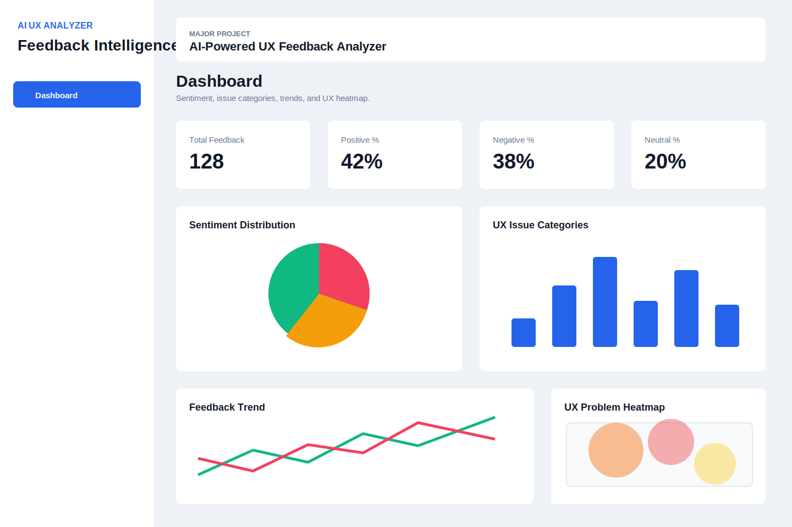

# AI-Powered UX Feedback Analyzer

An intelligent full-stack web application that analyzes feedback from app reviews, surveys, comments, and CSV uploads. It performs sentiment analysis, detects UX issue categories, generates actionable recommendations, stores results in SQLite, and presents everything in a responsive dashboard with charts and a simulated UX heatmap.



## Features

- Manual feedback analysis
- CSV upload for app review and survey datasets
- Text preprocessing with lowercasing, cleaning, stopword removal, tokenization, and lemmatization
- BERT sentiment analysis using Hugging Face Transformers when available
- Lightweight fallback sentiment model for offline/demo use
- UX issue detection for Navigation, Performance, UI Design, Accessibility, Bugs, and Usability
- Recommendation engine with priority levels
- SQLite persistence
- Dashboard cards, pie chart, bar chart, trend chart, tables, and heatmap
- Dark mode
- CSV export
- Sample dataset
- API documentation

## Architecture

```text
AI-UX-Analyzer/
├── backend/
│   ├── app.py
│   ├── routes/
│   ├── services/
│   ├── database/
│   ├── data/
│   ├── seed.py
│   └── requirements.txt
├── frontend/
│   ├── src/
│   ├── public/
│   ├── package.json
│   └── tailwind.config.js
├── docs/
│   ├── API.md
│   └── dashboard-screenshot.svg
└── README.md
```

## Backend Setup

```bash
cd backend
python -m venv .venv
.venv\Scripts\activate
pip install -r requirements.txt
python seed.py
python app.py
```

The API runs on `http://localhost:5000`.

The first run creates `backend/database/ai_ux_analyzer.db`.

For full spaCy lemmatization, install the English model:

```bash
python -m spacy download en_core_web_sm
```

If the Hugging Face model is unavailable, the backend automatically uses the included lexical sentiment fallback so the app remains demo-ready.

## Frontend Setup

```bash
cd frontend
npm install
npm run dev
```

The React app runs on `http://localhost:5173`.

Do not open `frontend/index.html` directly in the browser. It is the Vite source entry file and must be served by Vite. For a file-open preview, use `frontend/dist/index.html` after running `npm run build`.

## GitHub Pages Hosting

GitHub Pages can host the React frontend only. The Flask API must run separately on a backend host such as Render, Railway, Fly.io, or a VPS. This project includes a GitHub Actions workflow that deploys a static demo dashboard when you push to `main`.

1. Create a GitHub repository.
2. Push this `AI-UX-Analyzer` folder to the repository.
3. In GitHub, open `Settings -> Pages`.
4. Set `Source` to `GitHub Actions`.
5. Push to `main`, or run the `Deploy Frontend to GitHub Pages` workflow manually.

The Pages build uses `VITE_DEMO_MODE=true`, so Dashboard and Recommendations work without Flask. For a deployed frontend connected to a real hosted Flask API, set `VITE_API_URL` in the workflow environment to your backend URL and set `VITE_DEMO_MODE=false`.

To point the frontend to a different backend:

```bash
set VITE_API_URL=http://localhost:5000
npm run dev
```

## API Endpoints

- `POST /analyze`
- `POST /upload`
- `GET /dashboard`
- `GET /issues`
- `GET /recommendations`
- `GET /statistics`
- `GET /export`
- `GET /health`

Full details are in [docs/API.md](docs/API.md).

## CSV Format

Use a `text` or `feedback` column.

```csv
source,text
app_review,The app is slow and crashes.
survey,The navigation labels are unclear.
```

Sample data is included at `backend/data/sample_feedback.csv`.

## Example Analysis Output

```json
{
  "sentiment": {
    "sentiment": "Negative",
    "confidence": 0.92
  },
  "issues": [
    {
      "category": "Performance",
      "score": 0.74,
      "evidence": "slow, load"
    }
  ],
  "recommendations": [
    {
      "category": "Performance",
      "recommendation": "Optimize API response times, compress large assets, cache frequent requests, and use loading indicators.",
      "priority": "High"
    }
  ]
}
```

## Notes

This project is designed for major-project demonstrations. The AI services use production-style interfaces, but the issue detector and recommendation engine are intentionally explainable and easy to extend with zero-shot classification, authenticated users, PDF reports, real-time event streams, and chatbot support.
